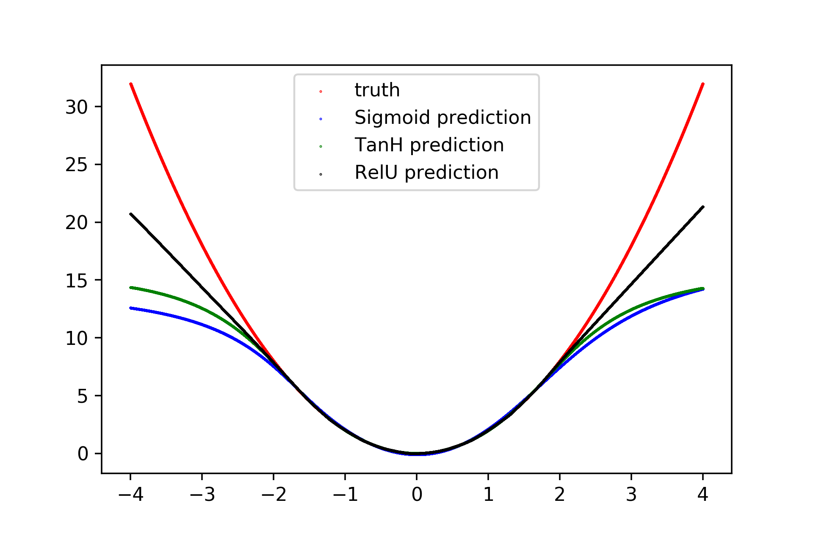
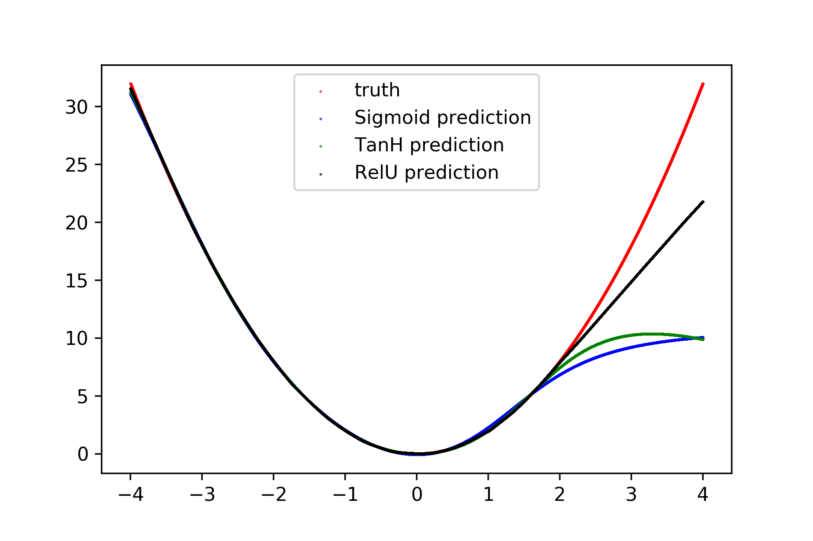
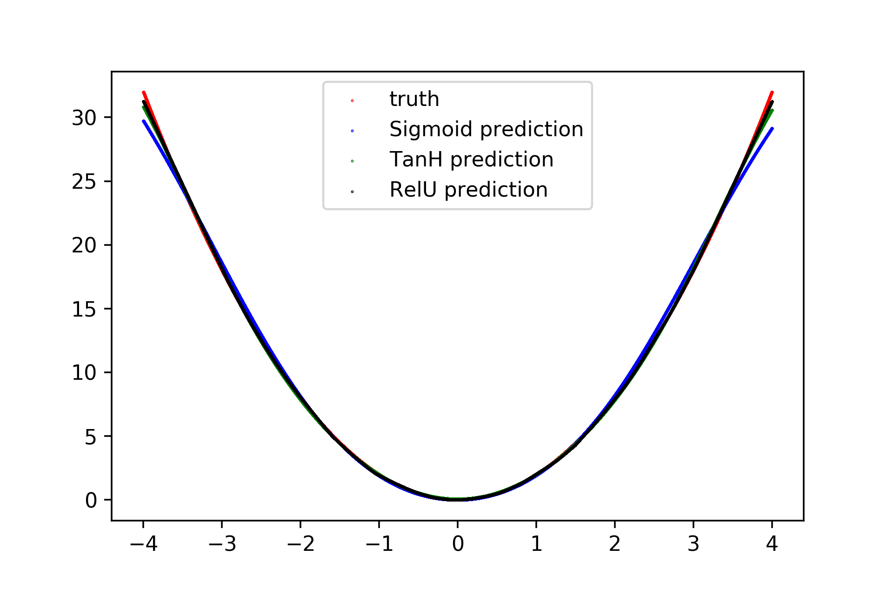

# NeuralNetDataDemo

This notebook plays with a toy dataset in which I test the effectivenss of Neural Networks w.r.t. the training data. The common adage is that neural networks are extremely modular function approximators. However, neural networks are also know for being data-hungry. As a trade off for this ability to fit complicated formulas, ANN perform unpredictably when given data outside of the domain of the training data.

## Test 1: Data within domain [-2,2] with 100k data points.

The main obsevation is that the model performs well within the range of the given data. But when going outside that range, the model makes horrible predictions. 

This indicates that neural networks will perform expotentially well at fitting the given data (which harkens back to the idea of an artificial neural network being a great function approximator). However, they will likely do horribly when it comes to data outside the given domain.

This gives insight to the idea of transfer learning. If a neural network only works well at fitting a given domain, to what confidence can be transfer domains and remain confident in the performance of our model? To answer this, we would have to find how "similar" two domains are. The current gap within that exercise is that there is no mathematical definition of the similarity of two domains. Maybe, a "domain" object can be defined in a mathematical framework such that a similarity measurement becomes quantifiable.

An interesting observation is that RelU performs the best at generalizability. RelU is also known for having good properties for learning within many-layer networks. This suggests another reason to use RelU over other non-linear functions within ANN.

## Test 2: Data within domain [-4,2] with 100k data points.

This shows that the ANN is able to learn even with asymmtrical function; the model interprolates the data irrespective of the underlying data generating process (apart from the given data). This both shows that an ANN is "smart" in that it can represent increasingly complicated functions; but also "dumb" in that it cannot observe patterns that may seem intuitive to a human observer, but not includes in the data.

## Test 3: Data within domain [-4,4] with 1k data points.

In this test, I only gave 1/100 of the original data, but gave a better sample of the data. Clearly (mostly due to the udnerlying generating function being basic) the data is being fit fairly well when given a sample of the domain. This is true even if the sample is smaller.

## Conclusion

The conclusion of this is that ANN are extremely powerful; but also extremely weak. ANN will (even in theory) represent any function. But this representation is inherently limited to the training data. To improve future ML/DL models, the focus may not be on the models, but rather perfecting the data generating process to counteract artificats and biases within the data.

If doing this again, I would added noise to the underlying data to show the need for more data, and try to understand the point of diminishing returns. In other words, although ANN are data-hungry, at what point does throwing more data at the problem becomes a foolish proposition.

